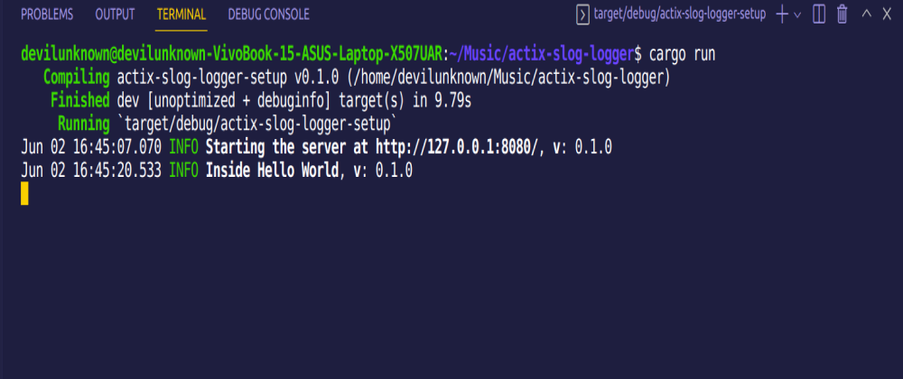

## Adding Slog Logger to Actix Web

We will learn how to use slog logger for logging in Actix web.
<a href="https://actix.rs/">Actix web</a> is a powerful, pragmatic, and extremely fast web framework for Rust and <a href="https://docs.rs/slog/2.7.0/slog/">Slog</a> is an ecosystem of reusable components for structured, extensible, composable logging for Rust. We will be using two crates of slog : `slog-async` and `slog-term` with the core Slog Core Package.


### Why Slog over default log crate?
* extensible
* composable
* flexible
* structured and both human and machine-readable
* contextual

### Crates used
* <a href="https://actix.rs/">Actix Web</a> : powerful web framework.
* <a href="https://crates.io/crates/slog">Slog Core Crate</a> : core package to the gateway of logging modules.
* <a href="https://crates.io/crates/slog-term">Slog Term</a> : Unix terminal drain and formatter for slog-rs.
* <a href="https://crates.io/crates/slog-term">Slog Term</a> : Asynchronous drain for slog-rs.

### Crated Version and Code
Simply paste the code in the `cargo.toml` file
```
slog = "2.7.0"
slog-term = "2.9.0"
slog-async = "2.7.0"
```

### Default template for Actix web
It is a default <a href="https://actix.rs/">hello world program</a> of Actix web 
```
use actix_web::{ web, App, HttpServer};

async fn index() -> &'static str {
    "Hello world!"
}

#[actix_web::main]
async fn main() -> std::io::Result<()> {
    println!("Starting the server at 127.0.0.1:8080");

    HttpServer::new(|| {
        App::new()
            .service(web::resource("/index.html").to(|| async { "Hello world!" }))
            .service(web::resource("/").to(index))
    })
    .bind(("127.0.0.1", 8080))?
    .run()
    .await
}
```

### Configure Logger

```
use slog;
use slog::{Logger,o,Drain,info};
use slog_term;
use slog_async;

fn configure_log()->Logger{
    let decorator = slog_term::TermDecorator::new().build();
    let console_drain = slog_term::FullFormat::new(decorator).build().fuse();
    
    // It is used for Synchronization
    let console_drain = slog_async::Async::new(console_drain).build().fuse();

    // Root logger
    slog::Logger::root(console_drain,o!("v"=>env!("CARGO_PKG_VERSION")))
}
```

Let's break the configuration function and understand what is happening behind the scene.

* **TermDecorator Decorator** : IT is used for formatting terminal output implemented using **term crate**. This decorator will add nice formatting to the logs it’s outputting. *Note* It does not deal with serialization so is !Sync. Run in a separate thread with slog_async::Async. We will be using the slog async with it. We can <a href="https://docs.rs/slog-term/2.9.0/slog_term/index.html#structs">other decorator</a> like CompactFormat, PlainRecordDecorator etc according to need.
* **FullFormat** : It is a Drain that will take *Decorator* as an argument, used for terminal output. Decorator is for formatting and Drain is for outputting.
* **Synchronization via Async Slog** : They are three ways slog to do synchronization out of which **PlainSyncDecorator** and **slog_async** are the efficient one depending on the need. Other than the two, the last **Synchronization via Mutex** is not efficient. You can read more <a href="https://docs.rs/slog-term/2.9.0/slog_term/index.html#structs">here</a>. We are using the synchronization with slog_async.
* **Logger::root** :<a href="https://docs.rs/slog/2.7.0/slog/struct.Logger.html#method.root">Logger</a> is used to execute logging statements. It takes two arguments 
    1. **drain** - destination where to forward logging Records for processing.
    2. **context** - list of key-value pairs associated with it.
* **o!** : Macro for building group of key-value pairs used as a content in Logger.

**fuse()** : It is used for panicking if something went wrong. It is necessary to call fuse as the root logger must take a Drain which is error free.

### Passing log instance to the handlers
Add the following line of code in main function
```
let log = configure_log();
```
It will configure the logger and ready to use now.


### Passing a log instance
```
HttpServer::new(move || {
        App::new()
            .app_data(web::Data::new(log.clone()))
            .service(web::resource("/index.html").to(|| async { "Hello world!" }))
            .service(web::resource("/").to(index))
    })
    .bind(("127.0.0.1", 8080))?
    .run()
    .await
```

**web::Data::new(log.clone())** : It is an application data stored with App::app_data() method available through the HttpRequest::app_data method at runtime.

### Accessing the Log instance in function handlers
```
async fn index(log: web::Data<Logger>) -> &'static str {
    info!(log,
        "Inside Hello World"
    );
    "Hello world!"
}
```

**info!** : It is  a macro used for the building Info Level Record Or Context(key-value pair) used by Logger to output. They are a bunch of macros you can be used for <a href="https://docs.rs/slog/2.7.0/slog/index.html#macros">different level records</a>

**log: web::Data<Logger>** : -
Essentials helper functions and types for application registration.

Request Extractors
* Data: Application data item
* ReqData: Request-local data item
* Path: URL path parameters / dynamic segments
* Query: URL query parameters
* Header: Typed header
* Json: JSON payload
* Form: URL-encoded payload
* Bytes: Raw payload

We are using the `Data` method to access the application data initialised in server instance in main function.

### Complete Code
```
use actix_web::{web, App, HttpServer};
// IT is used as a logging middleware. We can even use the default logger with actix.
use slog;
use slog::{Logger,o,Drain,info};
use slog_term;
use slog_async;

fn configure_log()->Logger{
    // Formatting the output https://docs.rs/slog-term/2.9.0/slog_term/index.html#
    let decorator = slog_term::TermDecorator::new().build();

    // Drain for outputting https://docs.rs/slog-term/2.9.0/slog_term/index.html#structs
    // fuse is used for panicking if something went wrong. It is necessary to call fuse as the root logger must take a Drain which is error free.
    let console_drain = slog_term::FullFormat::new(decorator).build().fuse();

    // It is used for Synchronization https://docs.rs/slog-term/2.9.0/slog_term/index.html#structs
    let console_drain = slog_async::Async::new(console_drain).build().fuse();
    slog::Logger::root(console_drain,o!("v"=>env!("CARGO_PKG_VERSION")))
}
async fn index(log: web::Data<Logger>) -> &'static str {
    info!(log,
        "Inside Hello World"
    );
    "Hello world!"
}

#[actix_web::main]
async fn main() -> std::io::Result<()> {
    let log = configure_log();

    info!(log,
        "Starting the server at http://127.0.0.1:8080/"
    );

    HttpServer::new(move || {
        App::new()
            .app_data(web::Data::new(log.clone()))
            .service(web::resource("/index.html").to(|| async { "Hello world!" }))
            .service(web::resource("/").to(index))
    })
    .bind(("127.0.0.1", 8080))?
    .run()
    .await
}
```

### Output


### Source Code
<a href="https://github.com/chaudharypraveen98/actix-slog-logger-setup">GitHub Source Code</a>


Added Comments for your quick revision and understanding.

#### Feel free to ask any questions or provide suggestions. I am too learning. So will be glad to get your feedback. Happy Hacking! Rustaceans!